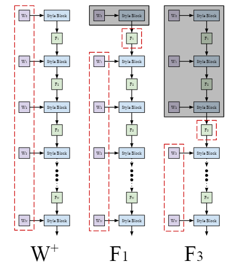

## Fine-Tuning Language Models with Just Forward Passes

1.Abstract:

This model has 12 times less memory than classic bachpropagation method.

The same memory usage as inference. In fine tune. As a result, the training time is much longer than the basic method.

2.LMs forward gradient pass.

## IS SYNTHETIC DATA FROM GENERATIVE MODELS READY FOR IMAGE RECOGNITION?

three parts:

data for zero-shot image generation

合成数据用于fine tune分类器效果有提升，相比于零样本模型clip。但是如果训练编码器的话就会有下降，如果从头训练某个模型比如resnet50等，也会有下降。

当前从文本到图像生成模型的合成数据确实可以为各种零样本图像分类任务带来显着的性能提升，并且很容易适用于精心设计的策略，例如大规模预训练模型。 当用于零样本任务时，多样性和可靠性对于合成数据很重要。 当使用合成数据从头开始训练模型时，合成数据无法提供令人满意的性能，并且与真实数据相比，数据效率和解决分类任务的效果要低得多。（合成数据集与真实数据分布之间存在域差异）

data for few-shot image generation.

在这个任务下的合成数据特性也是类似的。但是有真实数据的情况下，可以合理利用真实数据以期达到更好的性能。至于如何结合真实数据和合成数据以共同训练，实测中混合会比二阶段训练达到更好的效果。

且使用真实数据来指导合成数据是比使用真实数据筛选合成数据更好的手段。

实际情况中，合成数据有效提高了小样本图像识别的分类器性能，但是随着真实数据的增加，合成数据的提升效能逐渐变低。实际上，合成数据总是要比真实数据差一点，因为合成数据会有域差距和噪声，而真实数据则会有少样本时不稳定的问题。随着更多真实数据的出现，合成数据的积极影响将会减弱，这进一步证实了我们之前的观点，即在训练分类模型中合成数据仍然不如真实数据有效。

synthetic data for pre-training.

数据的重要特性：数据量、多样性。

合成数据的两种情景：

1.下游感知，知道下游标签

对于下游可知的情况，采用合成数据2.4m以上可以超过仅用in-1k预训练的效果。且两者兼具的话效果更好。

2.下游不可知，不知道下游标签，通过通用的多样化标签空间来生成。如imagenet-1K，然后再在cifar-100上生成。

随着数据量和多样性的增加，效果越来越好，最终接近持平in-1k上的moco-v2对应版本。

使用vit效果更好，可知该模型具有对大规模数据学习的更强能力。

合成数据预训练的几项结论：

1. 数据量对综合预训练有积极影响；可以通过增加合成数据大小来提高性能，但随着数据量的增加，性能会逐渐饱和。
2. 预训练的合成数据与预训练的真实数据正交。
3. 对于下游感知的合成预训练，我们在 CIFAR-100 上使用 2.4M/3.6M 合成数据，显着优于 IN-1K Real (1.2M) 预训练。
4. 对于下游不可知的综合预训练，我们取得了与 ImageNet (IN-1k) Real 预训练相当的结果；自监督预训练比监督预训练表现更好，基于 ViT 的主干比基于卷积的主干表现更好。此外，增加标签空间大小可以进一步提高性能。

## Synthetic Data from Diffusion Models Improves ImageNet Classification

简述：生成合成数据有利于在image net上实现多个框架超过基线的分类性能。

我们展示了 Imagen 文本到图像模型，当在 ImageNet 训练集上进行微调时，根据其 Fréchet 起始距离 (FID)，可以在多个分辨率下生成最先进的类条件 ImageNet 模型（Heusel 等人） al., 2017) 和 Inception Score (IS) (Salimans et al., 2016)； 例如，我们在 256 × 256 图像样本上获得的 FID 为 1.76，IS 为 239。 无论是否使用改进模型采样的指导，这些模型都优于现有的最先进模型。 我们进一步确定，来自此类微调的类条件模型的数据还提供了新的最先进的分类准确度分数 (CAS)（Ravuri & Vinyals，2019），通过在合成图像上训练 ResNet-50 模型来计算，然后 在真实的 ImageNet 验证集上评估它们（图 1 - 右）。 最后，我们表明，通过将合成数据与真实数据、大量合成数据以及更长的训练时间相结合，在生成数据上训练的模型的性能进一步提高。 这些结果适用于许多基于卷积和 Transformer 的架构（图 1 - 左）

评估标准：

Inception Score (Salimans et al., 2016) 来评估生成模型的视觉质量是标准做法。由于计算成本相对较低，这些指标被广泛用作生成模型训练和调整的代理。然而，这两种方法都倾向于严厉惩罚非 GAN 模型，并且 Inception Score 在经过采样修改的方法中产生过于乐观的分数（Ho & Salimans，2022；Ravuri & Vinyals，2019）。 Ravuri & Vinyals (2019) 还认为，这些指标与评估分类准确性等下游任务性能的指标并没有表现出一致的相关性。

另一个：lassification accuracy score (CAS),

实验：生成模型训练及采样

我们将解决两个主要问题：大规模文本到图像模型是否可以作为类条件 ImageNet 模型进行微调，以及这些模型在多大程度上可用于生成数据增强。

例如，如果人们天真地使用短文本描述符，例如 Radford 等人为 CLIP 制作的描述符。 (2021) 作为每个 ImageNet 类的文本提示，Imagen 模型生成的数据 (Saharia et al., 2022b) 很容易证明会产生较差的 ImageNet 分类器。一个问题是文本标签可能与多种视觉概念相关，或者与 ImageNet 系统不同的视觉概念相关（见图 2）。这种糟糕的性能也可能是 Imagen 使用高指导权重的结果，从而牺牲了样本质量的生成多样性。虽然有多种方法可以将文本到图像模型重新用作类条件模型，例如，优化提示以最小化分布变化，但这里我们将提示修复为关联的 CLIP 类名称（Radford 等人） al., 2021），并对基于扩散的生成模型的权重和采样参数进行微调

方法一：对生成模型参数进行微调，以期更好的生成优质合成数据。

方法二：对采样参数进行超参的选取。对64和646->256的上采样模型进行超参的选取。

result：

正如人们所预料的那样，仅根据生成的样本训练的模型比根据真实数据训练的模型表现更差。尽管如此，使用扩散模型中的合成图像来增强真实数据可以显着提高所有测试分类器的性能；使用配对 t 检验，结果具有统计显着性，p = 10−5。此外，ConvNets 相对于 Transformer 的性能提升没有明显趋势，因为性能增益随多个因素而变化，包括模型参数的数量和输入图像的分辨率

合成数据在多样性和数据量上增长后对性能有提升作用。

接下来我们考虑 ResNet-50 分类器的性能如何取决于用于增强真实数据的生成数据量。 在这里，我们遵循传统的训练方法，使用随机裁剪进行 130 个时期的训练，与表 2 中使用中心裁剪和仅 90 个时期的 CAS 结果相比，这里产生的 ResNet-50 准确度更高。 附录提供了培训详细信息。
Ravuri & Vinyals (2019)（他们的图 5）发现，对于几乎所有测试的模型，将生成的样本与真实数据混合会降低 Top-5 分类器的准确性。 对于具有低截断值（牺牲样本质量多样性）的 Big-GAN-deep（Brock 等人，2019），生成的数据量较少时，准确率略有增加，但随后很快下降到仅在真实数据上训练的模型以下： 生成的数据量接近真实训练集的大小。 相比之下，图 6 显示，对于 64×64 图像，随着生成的数据量增加至实际数据量的九倍，达到 12M 图像的总数据集大小，性能持续提高。 来自两个更高分辨率模型的样本的性能随着多达 1.2M 合成样本的增加而增加，然后缓慢下降。 尽管如此，性能仍然高于仅在真实数据上训练最多约 4M 合成样本的基线模型，即合成数据比真实数据多三倍。 （附录中的表 A.3 以表格形式提供了这些结果。）

但是这种生成图像的效果对于其他图像领域功效暂且不知。

其他：

最后，我们的实验发现了一些值得进一步研究的意想不到的现象。其中之一是 CAS 在 1024 × 1024 分辨率下的提升，这表明较大的图像比 256 × 256 的图像捕获更有用的图像结构，即使 1024 × 1024 图像在中心裁剪到 224 × 之前被下采样到 256 × 256 224 用于 ResNet-50 的输入。另一个问题涉及 64×64 的大量合成数据的分类准确性的持续增益，而在更高分辨率下，增益不是单调的（图 6 和表 A.3）。低分辨率下用于训练的信息可能较少，因此低分辨率下使用合成图像进行增强的机会更大。高分辨率下性能提升到1M合成图像后缓慢下降；这可能表明模型在高分辨率下存在更大的偏差，或者需要使用合成数据进行更复杂的训练方法。这些问题仍然是正在进行的研究的主题。

## Generalizing Dataset Distillation via Deep Generative Prior

特定的网络架构，但很难推广到其他架构。其次，虽然在玩具数据集上生成有洞察力的蒸馏图像，但这些方法通常无法在更高分辨率的数据集（例如，≥ 128 × 128 分辨率）上很好地工作，并且往往会蒸馏出性能不佳的视觉噪声图像。在这项工作中，我们认为这两个问题部分是由像素空间中的合成数据集参数化引起的。直接优化像素可能容易学习到与训练中使用的特定架构过度拟合的高频模式。为了解决这个问题，我们考虑将蒸馏过程规范化为一些可能有助于跨架构泛化的先验。然而，如何以及在何处执行这种正则化形成了微妙的平衡。例如，将我们的合成集限制为真实数据流可以显着减少跨架构性能差距，但正则化太强，无法学习良好的蒸馏数据集。在限制下，它减少到核心集选择 [7, 9, 28, 59]，众所周知，这不太有效。

采用三种训练方式：梯度匹配dc，分布匹配dm，训练轨迹匹配。

要使用深度生成再蒸馏而非直接优化合成像素。这样可以增加泛化能力，且可以保持高分辨率下的生成能力。

### 为什么要添加一个深度生成模型：

我们建议在蒸馏过程之前应用深度生成，而不是直接天真地优化合成像素（如所有以前的方法[8,12,44,45,62,64,67,70]）提炼到预先训练的生成模型的潜在空间中。我们发现这样的先验极大地增加了合成数据集对蒸馏过程中使用的“骨干”模型以外的体系结构的泛化（缺乏这种泛化是以前方法的最大限制之一）。此外，我们的新参数化有助于蒸馏更高分辨率的合成数据，而无需以前的蒸馏方法引起的高频噪声。最后，深度生成先验可以作为任何现有和未来数据集蒸馏方法的即插即用补充。具体来说，我们考虑一个深度生成模型 G，它在给定潜在向量 z（例如 GAN）的情况下输出样本 G(z)。在蒸馏时，我们将小型合成数据集 S 参数化为 S , {G(z) : z ∈ Z}, (4) 其中 Z 是一组潜在向量。由于 G 是完全可微的，我们可以优化 Z w.r.t.任何蒸馏目标，例如 LDC、LDM 或LMTT。请参阅算法 1 以获取我们方法的完整描述

### Choosing a Generative Model and Latent Space

使用style gan-xl模型。

用styleGan的fn模块来代替z空间，作为我们探讨的生成模型编码的潜在空间。

并且利用G的早期层来做初始化潜在的z向量。（这里的z是指我们定义的潜在编码空间）

### 节约内存的方式：分批次求导：

由于现代深度生成模型的前向传播通常需要大量的 GPU VRAM，因此我们的方法（如果简单地实现）变得难以在有限数量的 GPU 上运行。为了规避这个问题，我们采用了一种受梯度检查点启发的技术[16]。在每次蒸馏迭代中，我们首先获得合成图像 S = G(Z)，而不跟踪任何梯度。然后，我们计算蒸馏损失 L，计算该损失相对于合成图像的梯度 (∂L/∂S)，并删除用于计算 L 及其梯度的计算图。为了计算 ∂L/∂Z，我们重新计算通过 G 的前向传播，S = G(Z)，这次跟踪梯度以便我们知道 ∂S/∂Z。从这里开始，链式法则的应用给出了 ∂L/∂Z = (∂L/∂S)(∂S/∂Z)，我们用它来更新合成数据的潜在代码。例如，对于 128 × 128 分辨率的 StyleGAN-XL，这种节省内存的技巧可以让我们在每个具有 F0 空间的合成图像上节省近 2GB 内存。

3.3. 选择生成模型和潜在空间
为了实现灵活有效的参数化，我们用最近提出的 StyleGAN-XL [53]（StyleGAN3 [36] 的修改版本）来填补深度生成先验的角色。 StyleGAN 生成器不仅可以输出高保真图像 [35]，而且 (1) 提供多个灵活的潜在空间用于参数化图像 [1, 47] 和 (2) 通过架构固有地施加多样化且有趣的先验（即使在随机初始化时） [4]。 在我们的实验中，这使我们能够探索从不同层选择潜在空间并使用在分布外数据集甚至随机初始化上训练的生成器的效果。
提取 StyleGAN-XL 的潜在空间可以被视为伪反转任务。 然而，我们发现，即使是扩展的 W+ 潜在空间（传统 StyleGAN 反转空间中最灵活的），对于我们的目标来说限制性太大（见图 3）。 它限制了合成图像的真实性，但是，与真实图像反演不同，这些图像针对蒸馏任务进行了优化，并且不需要真实性。 之前的反演工作提出了 StyleGAN 中的“Fn”空间作为替代方案，使图像更加多样化和灵活 [47, 75]。 因此，我们选择提取这些“Fn”空间，这意味着优化 StyleGAN-XL 的“合成”网络的潜在表示的第 n 个隐藏层以及所有后续的 W+ 调制代码。 请注意，在这项工作中，z 和 Z 指的是 Fn 特征图与 W+ 代码的串联，而不是传统的 StyleGAN z 空间。 有关 StyleGAN-XL 架构和“Fn”空间的详细信息，请参阅附录。
由于这些“Fn”空间来自中间层并且没有关联的先验分布，因此我们使用相应类的潜在向量的经验分布来初始化潜在 z 向量。 通过访问 G 的早期层，可以轻松计算出这一点。 请参阅附录了解我们的初始化方案的详细信息

潜在空间选择：这里红框是被选择的优化空间，灰色则是被舍弃的空间。

只优化w可以认为我们编码整个生成器的输入空间，这样生成的图像非常现实。

只优化最底层近似于我们编码整个生成空间，这样生成的图像和我们针对像素优化无异。

这里的是G部分，是可微的。

前部的编码部分是我们需要训练的部分，通过指定的L类型（三种）计算出最后的编码器，以期得到更符合真实图像的（相似分布，相似梯度，相似训练轨迹的）蒸馏图像。

实验：

4.1. 寻找合适的潜在空间
考虑到 StyleGAN-XL [53] 的深度，GLaD 可以使用许多可能的潜在空间来参数化我们的合成数据集。 为了找到跨架构泛化的最佳潜在空间，我们对几个 ImageNet 子集进行了实验。 在图 3 中，我们看到了“flamingo”类的最终蒸馏图像。 较早的潜在空间在蒸馏图像上强制执行更强的先验，而较晚的潜在空间则为优化提供更大的灵活性以适应蒸馏目标（MTT、DC 或 DM）。 检查图 3，我们发现提取到 F12 空间的图像为 MTT 带来了最佳的跨架构泛化。 通过类似的实验，我们发现 F16 最适合 DC，F20 最适合 DM。
4.2. 提高跨架构泛化能力
跨架构泛化可以说是所有以前的数据集蒸馏方法中最缺乏的一点，它可以很好地理解蒸馏方法“理解”分类任务的程度，而不是简单地过度拟合给定的架构。 在表 1 中，我们展示了使用和不使用深度生成先验的 MTT、DC 和 DM 的跨架构结果。 对于每种方法和数据集，使用 Depth-5 ConvNet 作为“骨干”架构提取每类 1 个图像的合成集。 为了评估跨架构泛化，我们使用蒸馏集从头开始训练 AlexNet [41]、ResNet-18 [30]、VGG-11 [54] 和 ViT-b/16 [23] 并记录验证准确性。 我们在表 1 中记录了这 4 种架构的平均验证准确度。
对于每个测试数据集，GLaD 添加生成先验都略微或显着地改进了所有 3 种方法的跨架构泛化。 在表 3 中，我们还包含了 CIFAR-10 的跨架构结果。 即使在这种较低分辨率的数据上，GLaD 也显着提高了原始 MTT 和原始 DM 的性能，而仅在 DC 上显示出边际增益。

泛用性：

我们发现 GLaD 可以成功地使用在完全不同的数据集上训练的生成器（例如 FFQH [37] 和 Pok ́emon [49]），甚至根本没有经过训练的生成器（a-la深度图像先验[61]）。在表 4 中，我们将像素空间和标准 GAN 结果与使用在 FFHQ 和 Pok emon 上训练的生成器以及根本没有经过训练的生成器进行的生成潜在蒸馏进行了比较。这些结果使用 DC，使用 MTT 和 DM 的结果可在附录中找到。与直接提取到像素空间的图像相比，使用 FFHQ、Pok emon 和随机生成器提取的图像仍然提供跨架构泛化改进，通常匹配或超越使用标准 ImageNet 生成器的结果。我们还注意到，使用随机高斯噪声初始化潜在图像会根据所使用的生成器产生具有不同“艺术”属性的美观图像（图 7）。这种趋势也扩展到更大的图像，使我们的方法能够创建不同风格的基于类的数字艺术，如图 9 中的“马赛克”。 5. 讨论和限制 在这项工作中，我们建议利用生成之前数据集蒸馏（GLaD）。通过应用深度生成先验，我们引入了一种新方法，可以显着提高蒸馏图像的泛化能力。这种趋势一直延伸到（并可能超出）512×512 图像，使我们能够以比以往更高的分辨率生成高质量的蒸馏图像。由于 GLaD 可以作为任何数据集蒸馏方法的即插即用补充，因此未来的工作可以使用它来提高数据的通用性并生成更高分辨率的图像。局限性。将 StyleGAN-XL 引入蒸馏管道会创建一个巨大的新内存池。我们的检查点技巧使我们能够在一定程度上缓解这个问题。然而，这也是以第二次前向通过发生器为代价的。鉴于生成器的单次传递非常耗时，第二次传递会使开销加倍。此外，足够大的合成集需要通过生成器分批完成，这进一步增加了所需的额外时间。幸运的是，GLaD 与任何可微的生成模型兼容，因此未来开发更高效的生成模型自然也会降低我们方法的成本。

## Effective Data Augmentation With Diffusion Models

DA-Fusion 以尊重其语义不变性的方式修改对象的外观，例如图 1 中卡车上的涂鸦设计和图 2 中火车的设计。我们在少样本图像分类上测试我们的方法任务，包括位于扩散模型词汇范围之外的现实世界杂草识别任务。在所有领域中使用相同的超参数，我们的方法优于之前的工作。 DA-Fusion 将数据增强提高了 10 个百分点，并且消融表明我们的方法对于超参数分配具有鲁棒性。

两种防止稳定扩散训练数据泄漏的方法。我们首先考虑一种以模型为中心的方法，通过编辑模型权重来删除类知识来防止泄漏。我们还考虑一种以数据为中心的方法，从模型输入中隐藏类信息

如何解决不可知概念的生成：

我们通过在生成模型的文本编码器中插入 c 个新嵌入，并仅微调这些嵌入以最大化生成新概念的可能性，使扩散模型适应新概念。适应生成模型在生成合成图像时，以前的工作使用具有指定类名的提示He et al. [2022]。然而，对于生成模型词汇之外的概念来说这是不可能的，因为模型的文本编码器尚未学习描述这些概念的单词。我们在第 5 节中通过我们贡献的杂草识别任务讨论这个问题，当提供类名称时，我们的预训练扩散模型无法生成该任务。解决这个问题的一个简单方法是让模型的文本编码器学习新单词来描述新概念。文本倒置 [Gal et al., 2022] 非常适合于此，我们用它从数据集中每个类别的少量标记图像中学习单词嵌入w i

如何平衡真实图像和合成图像：使用α来调整分布。

合成图像上的训练模型通常存在过分强调由于不完美的生成模型 Antoniou 等人造成的虚假质量和偏差的风险。 [2017]。常见的解决方案是为真实图像和合成图像分配不同的采样概率来管理不平衡。 [2022]。我们在方程 7 中采用类似的方法来平衡真实数据和合成数据，其中 α 表示合成图像出现在小批量图像 B. i ∼ U({1, . . . , N }), j ∼ U({1, . . . , M }) (7) Bl+1 ← Bl ∪ Xi w.p. (1 − α) else ̃Xij (8) 这里 X ∈ RN ×H×W ×3 表示 N 个真实图像的数据集，i ∈ Z 指定特定图像 Xi 的索引。对于每个图像，我们生成 M 个增强，从而生成一个具有 N × M 图像增强的合成数据集 ̃X ∈ RN ×M ×H×W ×3，其中 ̃Xij ∈ RH×W ×3 枚举了第 i 个图像的第 j 个增强。数据集。索引 i 和 j 分别从可用的 N 个真实图像及其 M 个增强版本中均匀采样。给定索引 ij，以 (1 − α) 的概率将真实图像图像 Xi 添加到批次 B，否则添加其增强图像 ̃Xij。超参数详细信息在附录 G 中给出，我们发现 α = 0.5 在所有测试的领域中都能有效工作，这同样平衡了真实图像和合成图像

如何生成合成图像：

我们不是从头开始生成，而是使用真实图像作为指导。遵循 SDEdit Meng 等人的先前工作，我们将真实图像拼接到扩散模型的生成过程中。 [2022a]。给定 S 个步骤的反向扩散过程，我们在时间步 ⌊St0⌋ 插入一个带有噪声 ε ∼ N (0, I) 的真实图像 xref 0，其中 t0 ∈ [0, 1] 是控制图像插入位置的超参数

如何改善合成图像的多样性：调整插入时间t0的分布。
